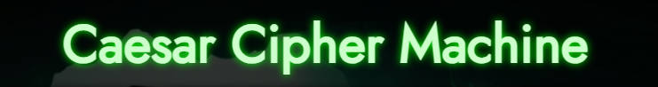
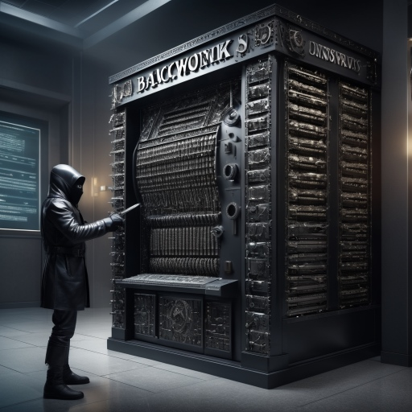
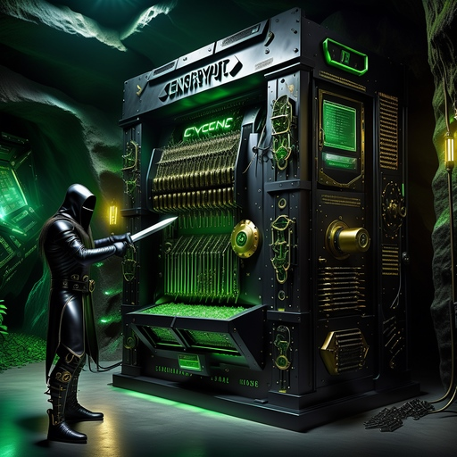

 

### _**One of the simplest and most well-known ciphers is the Caesar Displacement Cipher. A common modern use is the ROT13 encryption.**_

**Encrypt or decrypt secret phrases or words**

#### **More images generates with AI, but discarded for the this project**

 

🟩 **Visit:** [Caesar Cipher Machine ↗](https://conancos.dev/next/logica-js/CaesarCipherMachine/index.html) 🟩

